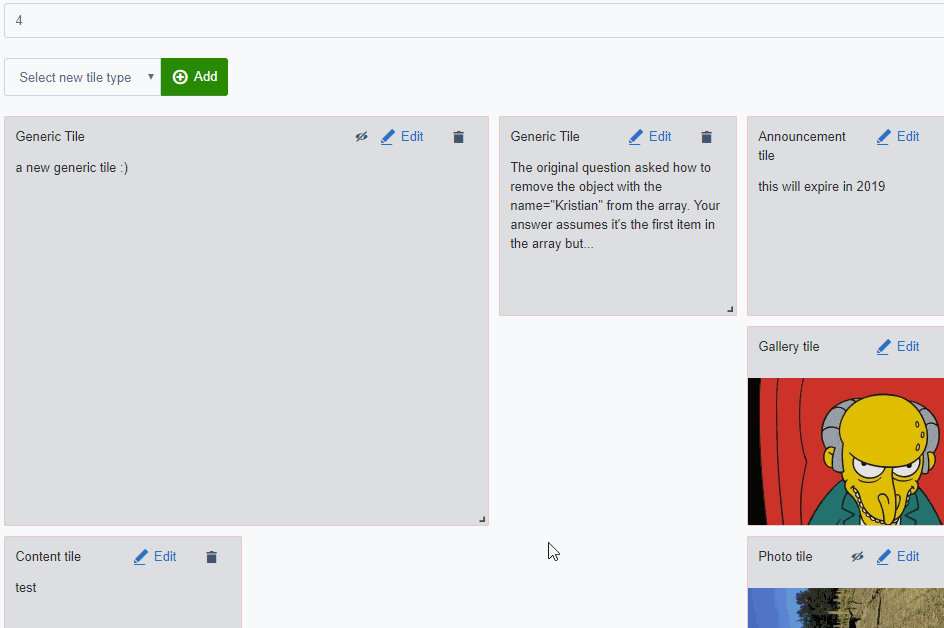

# Tiling system for SilverStripe CMS



Allows you to create an [elemental](https://github.com/dnadesign/silverstripe-elemental) grid inside SilverStripe. Features include:

1. drag & reorder them inside the CMS
2. easily create your own tiles
3. delete and edit tiles easily

It also comes with some basic tiles out of the box. 

# Install 

Run this in your command line:
```
composer require otago/tiles
```

To expose the modules resouces:

```
composer vendor-expose
```

The module requires [elemental blocks](https://github.com/dnadesign/silverstripe-elemental). If you don't have this module, you'll be prompted on install.

# Customise your tiles

Put your own templates in your themes/\<themename\>/templates/Tiles/tilename.ss. For example,
to make your own ContentTile in the simple theme, create a file in 
**themes/simple/templates/Tiles/ContentTile.ss**

```html
<div class="tile">
	<div class="tile__$CSSName tile__size$getSize <% if $Color %>$Color<% end_if %>">
		$Content
	</div>
</div>
```

If you want to support MSIE, you can use the -ms-grid-row and -ms-grid-column CSS 
values with $Col and $Row to have the grid display correctly. 


# Build source

You'll need node 6. Boo.

```
npm run watch
```

to get env vars on windows:
```
npm install -g win-node-env
```

This module uses fancy and modern react for rendering. So you know it's fast and snappy.

# Usage

After a composer install you'll have the tile module as an element. So you don't need to do anything (unless you've restricted the elements on each page).

If you want to put tilefield directly on a page, you can do this too. The following example shows you how:

```php
use OP\Fields\TileField;

class MyPage extends Page {

	static $has_many = [
		'Tiles' => Models\Tile::class
	];

	function getCMSFields() {
		$fields = parent::getCMSFields();
		$fields->addFieldToTab('Root.Main', TileField::create('Tiles', 'Tiles'));
		return $fields;
	}
}
```
## Allowing the user to specify how many columns they want

You can provide an DataObject where the Cols val will be written to. so you can have 3,2 or however many cols you want wide:

```php

use OP\Fields\TileField;

class MyTilePage extends Page {
	private static $db = [
		'Cols' => 'Int'
	];
	private static $has_many = [
		'Tiles' => Tile::class
	];
	private static $owns = [
		'Tiles'
	];
	public function getCMSFields() {
		$fields = parent::getCMSFields();
		$tilefield = TileField::create('Tiles', 
			'Tiles',
			$this->Tiles(), 
			null, 
			$this // this var requires a db object Cols to remember how many cols it is wide
		);
		
		$fields->addFieldToTab('Root.Main', $tilefield);
		return $fields;
	}
}
```


## Specifying types of tiles in field

You can limit the CMS dropdown to a limited number of tiles. This is handy when you've have a page where you only want a certain type of tile. This is done by passing in the $dataList parameter: 

```php
		$tile = DataObject::create(array('Name'=>'StaffHubResourceTile', 'NiceName' => StaffHubResourceTile::functionGetNiceName()));
		
		$fields->addFieldToTab('Root.Main', TileField::create('Tiles', 'Tiles', ArrayList::create(array($tile))));
```

## upgrading

Here's the modulelegacy.yml file to convert your tiles from 3 to 4:
```yml
---
Name: mymodulelegacy
---
SilverStripe\ORM\DatabaseAdmin:
  classname_value_remapping:
    GalleryTile: OP\Models\GalleryTile
    ContentTile: OP\Models\ContentTile
    LinkTile: OP\Models\LinkTile
    AnnouncementTile: OP\Models\AnnouncementTile
    PhotoTile: OP\Models\PhotoTile
    Slide: OP\Models\Slide
```
